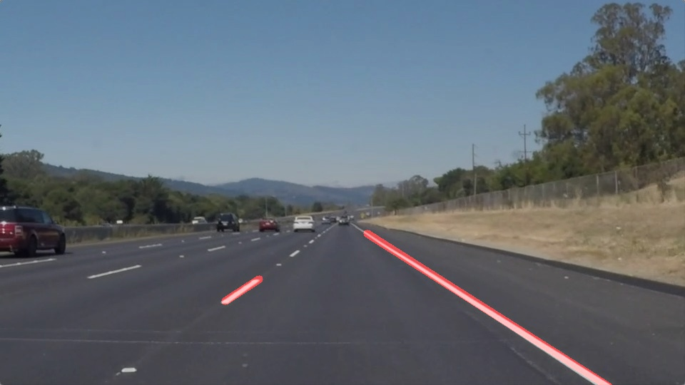
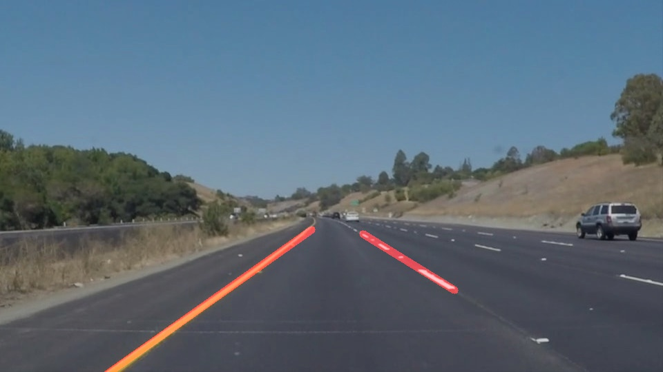

# **Output Images**

solidWhiteCurve

solidWhiteRight

solidYellowCurve

solidYellowCurve2

solidYellowLeft

whiteCarLaneSwitch

# **Run P1.ipynb**
I use ipywidgets's interact widget to tune the parameters, so install ipywidgets first

## Install

conda install -c conda-forge ipywidgets
