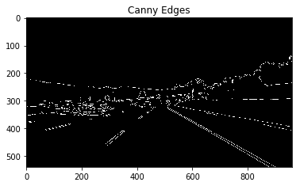
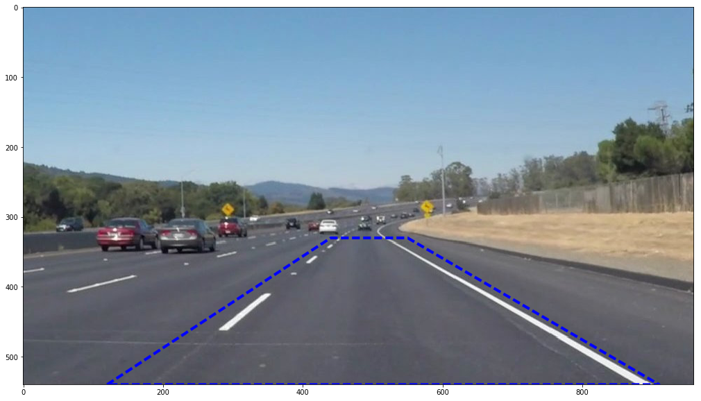
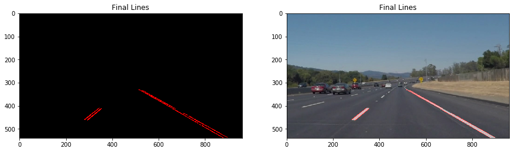
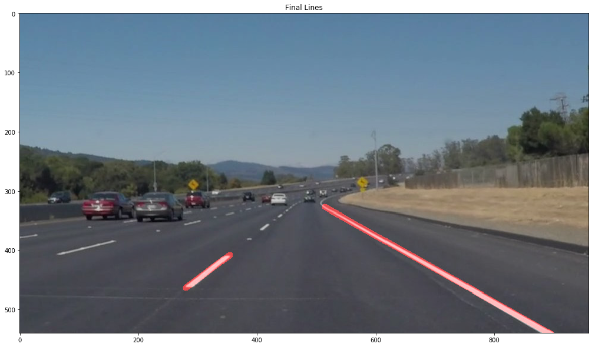

# **Finding Lane Lines on the Road**

---

**Finding Lane Lines on the Road**

The goals / steps of this project are the following:
* Make a pipeline that finds lane lines on the road
* Reflect on your work in a written report

[//]: # (Image References)

[image1]: ./examples/grayscale.jpg "Grayscale"

---

### Reflection

### 1. Pipeline

My pipeline consisted of 5 steps.

1) I converted the images to grayscale

![alt text][image1]

2) apply Gaussian smoothing and generate edges use opencv canny. I use interactive sliders to tune parameters.

3) Define ROI. Make sure the buoundbox cover lanes

4) Generate lines with opencv hough

5) Find actual left and right lane lines. I modified the draw_lines() function by
a) use slope of the lines to seperate lines to left and right catogery. Slope threshhold is zero.

b) using ransac algo to find left line, right line.
As ransac can robustly fit the line, even the slope threshold is not so acurate.

### 2. Potential shortcomings with your current pipeline

1. the ROI is hardcode. So when run with challenge video, neeed redesign ROI.

2. opencv canny(same parameters) doest not work well with images under different sun light

### 3. Suggest possible improvements to your pipeline

1. use deep learning to find lane marker
